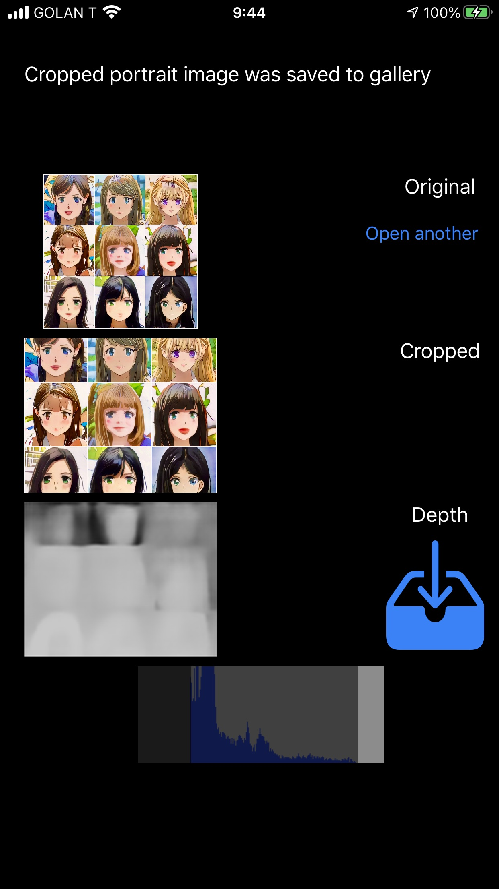

# FCRN-CoreML sample app
## iOS and macOS

Depth Estimation sample Apps for iOS and macOS, using the FCRN-DepthPrediction models Apple provided on their [model page](https://developer.apple.com/machine-learning/models/). 

  

* Loads an image and crops it to the input size requested by the FCRN model
* The same helper class _ImagePlatform_ provides hardware accelerated processing tools for both iOS and macOS images and buffers
* Supports both _FCRN-16_ and _FCRN-32_ models 
* You can post the predicted cropped portrait photo to Facebook as a 3D photo directly from your iPhone

     

* You can also post the cropped predicted depthmap together with the cropped input image photo to Facebook as a 3D photo directly using a browser on your Mac or PC. See [this guide](https://www.facebook.com/help/www/414295416095269) for more information.

### Before you try the sample App you need to download a model and save it in the _mlmodel_ folder

You can download FCRN-DepthPrediction CoreML models from [https://developer.apple.com/machine-learning/models/](https://developer.apple.com/machine-learning/models/)

You can download just one of them, both work with this project.
Choose which one to use by setting the relevant build target in Xcode

FCRN.mlmodel
Storing model weights using full precision (32 bit) floating points numbers.
254.7MB
[https://docs-assets.developer.apple.com/coreml/models/Image/DepthEstimation/FCRN/FCRN.mlmodel](https://docs-assets.developer.apple.com/coreml/models/Image/DepthEstimation/FCRN/FCRN.mlmodel)

FCRNFP16.mlmodel
Storing model weights using half-precision (16 bit) floating points numbers.
127.3MB
[https://docs-assets.developer.apple.com/coreml/models/Image/DepthEstimation/FCRN/FCRNFP16.mlmodel](https://docs-assets.developer.apple.com/coreml/models/Image/DepthEstimation/FCRN/FCRNFP16.mlmodel)